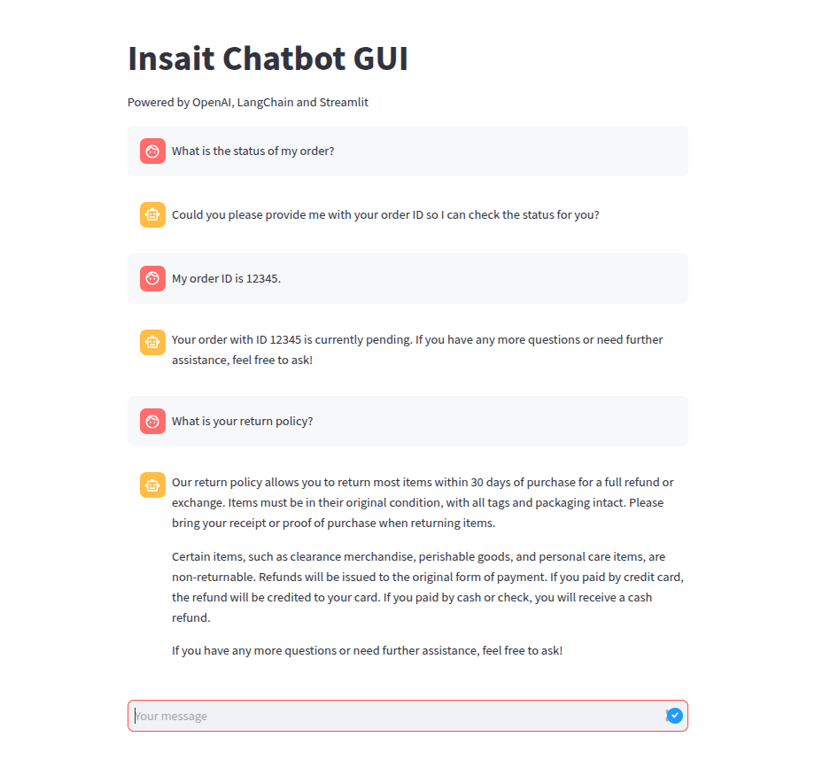

## Chatbot-Agent: Your E-commerce Conversational Agent

Chatbot-Agent is a user-friendly chatbot designed to handle customer support queries for your e-commerce platform. It can manage multi-turn conversations, providing accurate information on order status, return policies, and more. This versatile tool empowers you to enhance customer experience and streamline support operations.



### Getting Started

**Prerequisites:**

*   Before running the chatbot, ensure you have set up the `env` file with the correct OpenAI API key.
*   Docker (recommended for easy deployment)
*   Python 3.6 or later (if running manually)

### Setting Up the OpenAI API Key

1. Create a `.env` file at the root of your project with the following line:

    ```bash
    OPENAI_API_KEY=YOUR_ACTUAL_API_KEY
    ```

2. Replace `YOUR_ACTUAL_API_KEY` with your actual OpenAI API key obtained from [OpenAI API](https://beta.openai.com/account/api-keys).

### Project Structure

```
./
├── .github/
│   └── workflows/
│       └── main.yml  # GitHub Actions workflow for CI
│
├── assets/
│   └── demo.png  # Sample UI demo of the chatbot
│
├── docs/
│   └── how_it_works.md  # Detailed explanation of the chatbot agent architecture
│
├── evaluation/
│   ├── evaluation.csv        # Evaluation results of chatbot performance
│   └── evaluation_report.md  # Detailed analysis and insights from the chatbot evaluation
│
├── app/
│   ├── agent.py        # Main chatbot logic implemented using LangChain Agent Executor
│   ├── chatbot_cli.py  # Command-line interface for interacting with the chatbot
│   ├── chatbot_gui.py  # GUI-based chatbot interface using Streamlit
│   └── __init__.py     # Package initializer
│
├── tests/
│   ├── __init__.py     # Test package initializer
│   └── test_agent.py   # Unit tests for chatbot functionality
│
├── .env                # Environment variables configuration file
├── Dockerfile         # Configuration for containerizing the chatbot
├── requirements.txt   # Required dependencies for running the chatbot
├── README.md         # Project documentation
```

### Continuous Integration

The project includes a GitHub Actions workflow (`.github/workflows/main.yml`) that automatically runs the test suite on every push to the repository. This ensures code quality and catches potential issues early in the development process.

### Running the Chatbot with Docker

1.  Build the Docker image:

    ```bash
    docker build -t insait-chatbot-image .
    ```

2.  Run the container *(passing --env-file .env is only neccessary if the .env file was updated post-image-build)*:

    ```bash
    docker run -p 8501:8501 --env-file .env --name insait-chatbot insait-chatbot-image
    ```

3.  Open your web browser and navigate to `http://localhost:8501/`.

4.  Stop the container:

    ```bash
    docker stop insait-chatbot
    ```

### Running the Chatbot Manually

**Installation:**

1.  **Create a virtual environment (recommended):**

    ```bash
    python -m venv venv
    source venv/bin/activate  # Linux/macOS
    venv\Scripts\activate.bat  # Windows
    ```

2.  **Install dependencies:**

    ```bash
    pip install -r requirements.txt
    ```

**GUI Version:**

1.  Start the server:

    ```bash
    streamlit run app/chatbot_gui.py
    ```

2.  Open your web browser and navigate to `http://localhost:8501/`.

**CLI Version:**

1.  Run the script:

    ```bash
    python3 app/chatbot_cli.py
    ```

### Running Tests

To run the test suite:

1. Ensure you're in your virtual environment and have installed the development dependencies

2. Run all tests from the project root:
    ```bash
    pytest -v tests/
    ```

### Using the Chatbot

The chatbot interface is intuitive and straightforward. Simply type your questions or requests, and the chatbot will respond accordingly.

**Features:**

*   **Order Status:** Get real-time updates on your order status by providing your order ID.
*   **Return Policy:** Explore the return policy details, including eligible items, timeframes, and refund processes.
*   **Human Representative:** Request to connect with a customer support representative for more complex inquiries.

### Chatbot Architecture

Insait-Chatbot is powered by **LangChain Agent Executor**, which dynamically integrates various tools based on user requirements. This modular approach allows the chatbot to:

*   **Dynamically add tools** for different functionalities like order tracking, return policy retrieval, and human representative requests.
*   **Scale easily** by integrating additional services, such as inventory tracking or personalized recommendations.
*   **Enhance customer experience** by intelligently managing multi-turn conversations.


#### Documentation
For a detailed explanation of how the chatbot agent works, including its architecture, components, and decision-making process, please refer to [docs/how_it_works.md](docs/how_it_works.md).

### Evaluation Summary

The chatbot was tested using multiple scenarios to evaluate its accuracy, relevance, and user satisfaction. Below are key findings:

* **Accuracy:** 100% correctness in retrieving order details, return policies, and forwarding representative requests.
* **Relevance:** The chatbot provided highly contextual responses aligned with user queries.
* **User Satisfaction:** The majority of responses received "Very Satisfied" ratings, indicating a positive user experience.
* **Scalability:** Due to its modular approach with LangChain, additional tools and functionalities can be incorporated dynamically with minimal adjustments.

For a detailed analysis of test cases, responses, and user feedback, refer to [evaluation/evaluation_report.md](evaluation/evaluation_report.md).

### Additional Notes:

*   The chatbot is currently for assessment purposes, and its capabilities can be improved upon request.
*   An Evaluation Report, which includes prompts, responses, and metrics, is provided in the [evaluation/evaluation_report.md](evaluation/evaluation_report.md) file.
*   For optimal performance, ensure you have a stable internet connection.

I encourage you to explore the Insait-Chatbot and leverage its potential to enhance your customer support efforts.
